<p align="center">
  
</p>

<p align="center">
  <strong>Generate animated SVG terminal recordings from code.</strong>
</p>

<p align="center">
  <a href="https://www.npmjs.com/package/dvdrw"></a>
  <a href="https://www.npmjs.com/package/dvdrw"></a>
  <a href="https://github.com/tool3/dvd/blob/master/LICENSE.md"></a>
  <a href="https://github.com/tool3/dvd-cli"></a>
</p>

`dvdrw` is the Node library behind [`dvd-cli`](https://github.com/tool3/dvd-cli) — call it from your own code, your build pipeline, or your service. Output is a single self-contained animated SVG. No ffmpeg, no headless browser, no shelling out.

```bash
npm install dvdrw
```

```typescript
import dvd from 'dvdrw';

const { svg } = await dvd(`
  Type "echo hello world"
  Enter
  Sleep 800ms
`, { theme: 'dracula', template: 'macos' });
```

<p align="center">
  
</p>

---

## Contents

- [Why the library?](#why-the-library)
- [Inputs](#inputs)
  - [CD script string](#1-cd-script-string)
  - [Programmatic steps](#2-programmatic-steps)
  - [Raw terminal output](#3-raw-terminal-output)
  - [Pre-parsed script](#4-pre-parsed-script)
- [Themes](#themes)
- [Templates](#templates)
- [Loop styles](#loop-styles)
- [Branded output](#branded-output)
- [Progress tracking](#progress-tracking)
- [Low-level API](#low-level-api)
- [Rendering modes](#rendering-modes-filmstrip-vs-smil)
- [Options reference](#options-reference)
- [Steps reference](#steps-reference)
- [Comparison](#comparison)
- [Related](#related)

---

## Why the library?

The CLI is great when you have a `.cd` script in a file. The library is for everything else:

- **Programmatic content** — render the output of a real test run, a real deploy, or a real benchmark, with frames built from runtime data.
- **Raw stdout capture** — feed any ANSI byte stream straight in (`{ raw }`). Spinners, progress bars, `chartscii`, `lolcat`, anything that animates on the terminal.
- **Build-pipeline integration** — fully `async`, optional `onProgress` callback, no temp files, no subprocesses by default.
- **Embeddable** — drop into a docs generator, a service, an Electron app, a serverless function. The output is a string.
- **Composable** — the parser, terminal emulator, coalescer, emitter and animator are all exported and usable independently.

If you want a single command on the CLI that takes a `.cd` file and writes a `.svg`, use [`dvd-cli`](https://github.com/tool3/dvd-cli). If you want to call into the engine, you're in the right place.

---

## Inputs

`dvd(input, options)` accepts four input shapes. Pick whichever matches the data you already have.

### 1. CD script string

The fastest path. Same syntax as `dvd-cli`, just inlined.

```typescript
const { svg } = await dvd(`
  Type "npm install dvdrw"
  Sleep 400ms
  Enter
  Sleep 800ms
`, { theme: 'dracula', template: 'macos', title: 'quick-start' });
```

### 2. Programmatic steps

When the content of your animation is computed at runtime — a generated test report, a stream of deploy events, a templated demo — skip the script and pass an array.

```typescript
// Each Type+Enter is sent through a real shell, so wrap any styled output
// in `echo -e "..."` rather than typing raw ANSI as a command.
const steps = [
  { type: 'Type', text: 'echo -e "\\x1b[2m$\\x1b[0m npm test"' },
  { type: 'Key', key: 'Enter' },
  { type: 'Sleep', duration: 600 },
  ...tests.flatMap((t) => [
    { type: 'Type', text: `echo -e "\\x1b[32m  ✓\\x1b[0m ${t.name} \\x1b[2m(${t.ms}ms)\\x1b[0m"` },
    { type: 'Key', key: 'Enter' },
    { type: 'Sleep', duration: 200 },
  ]),
];

const { svg } = await dvd(steps, { theme: 'tokyoNight', template: 'macos', title: 'test runner' });
```

<p align="center">
  
</p>

> Full source: [`examples/02-programmatic-steps.ts`](examples/02-programmatic-steps.ts)

### 3. Raw terminal output

Capture stdout from any command and hand the bytes over. dvd auto-detects the animation pattern (cursor reset, terminal reset, clear-line, cursor-up) and splits into frames automatically.

```typescript
import dvd from 'dvdrw';
import { spawnSync } from 'node:child_process';

const r = spawnSync('myscript.sh', { encoding: 'buffer' });
const raw = r.stdout.toString('binary');

const { svg } = await dvd({ raw, totalDuration: 2400 }, {
  theme: 'catppuccinMocha',
  template: 'macos',
  title: 'spinner capture',
});
```

<p align="center">
  
</p>

> Full source: [`examples/03-raw-output.ts`](examples/03-raw-output.ts)

### 4. Pre-parsed script

If you've already parsed a CD script (e.g., for validation or transformation), pass the AST directly:

```typescript
import dvd, { parseCDScript } from 'dvdrw';

const script = parseCDScript(scriptText);
// ...mutate, validate, splice frames...
const { svg } = await dvd({ script }, { theme: 'nord' });
```

---

## Themes

37 built-in themes, all exported from `themes`. Pass by name or as a full `Theme` object.

```typescript
await dvd(script, { theme: 'tokyoNight' });
```

<table>
<tr>
  <td align="center"><strong>dracula</strong><br></td>
  <td align="center"><strong>tokyoNight</strong><br></td>
</tr>
<tr>
  <td align="center"><strong>catppuccinMocha</strong><br></td>
  <td align="center"><strong>nord</strong><br></td>
</tr>
<tr>
  <td align="center"><strong>gruvboxDark</strong><br></td>
  <td align="center"><strong>monokai</strong><br></td>
</tr>
<tr>
  <td align="center"><strong>oneDark</strong><br></td>
  <td align="center"><strong>synthwave84</strong><br></td>
</tr>
</table>

The full list: `a11yDark`, `base16Dark`, `base16Light`, `blackboard`, `catppuccinMocha`, `cobalt`, `dark`, `dracula`, `draculaPro`, `duotoneDark`, `githubDark`, `githubLight`, `gruvboxDark`, `gruvboxLight`, `hopscotch`, `lucario`, `material`, `monokai`, `night3024`, `nord`, `oceanicNext`, `oneDark`, `oneLight`, `pandaSyntax`, `paraisoDark`, `seti`, `shadesOfPurple`, `solarizedDark`, `solarizedLight`, `synthwave84`, `terminal`, `tokyoNight`, `twilight`, `verminal`, `vscode`, `yeti`, `zenburn`.

For custom palettes, pass a `Theme` object directly:

```typescript
import dvd, { type Theme } from 'dvdrw';

const retroGreen: Theme = {
  name: 'retro',
  background: '#0a0a0a',
  foreground: '#00ff00',
  cursor: '#00ff00',
  // ...the 16 ANSI colors
};

await dvd(script, { theme: retroGreen });
```

> Source: [`examples/04-themes-gallery.ts`](examples/04-themes-gallery.ts)

---

## Templates

Window chrome — `macos` / `windows` / `minimal`.

<table>
<tr>
  <td align="center"><strong>macos</strong></td>
  <td align="center"><strong>windows</strong></td>
  <td align="center"><strong>minimal</strong></td>
</tr>
<tr>
  <td></td>
  <td></td>
  <td></td>
</tr>
</table>

> Source: [`examples/09-templates.ts`](examples/09-templates.ts)

---

## Loop styles

Animations loop by default. Choose how the loop behaves at the boundary:

```typescript
await dvd(script, {
  loopStyle: 'reverse',  // 'loop' | 'reverse' | 'rewind' | 'fade'
  loopPause: 600,
  rewindSpeed: 6,        // for 'rewind'
  fadeDuration: 1200,    // for 'fade'
});
```

<table>
<tr>
  <td align="center"><strong>loop</strong> — restart from frame 0<br></td>
  <td align="center"><strong>reverse</strong> — play forward then back<br></td>
</tr>
<tr>
  <td align="center"><strong>rewind</strong> — fast reverse like rewinding tape<br></td>
  <td align="center"><strong>fade</strong> — fade to black, fade back in<br></td>
</tr>
</table>

> Source: [`examples/05-loop-styles.ts`](examples/05-loop-styles.ts)

---

## Branded output

Gradient backgrounds, watermarks, custom borders — for docs sites and landing pages where the SVG carries product weight.

```typescript
const { svg } = await dvd(script, {
  theme: 'tokyoNight',
  template: 'macos',
  background: 'gradient(#7c5fff, #ff6ec7:diagonal)',
  backgroundPadding: 48,
  borderRadius: 12,
  watermark: 'made with dvd',
});
```

Backgrounds accept solid colors (`#1a1a2e`) or gradients in the form `gradient(<color>, <color>[:vertical|horizontal|diagonal])` with as many stops as you need.

<p align="center">
  
</p>

> Source: [`examples/06-branding.ts`](examples/06-branding.ts)

---

## Progress tracking

Wire dvd into your build pipeline or TUI. The `onProgress` callback fires for every step the executor runs.

```typescript
await dvd(script, {
  onProgress: (current, total, description) => {
    const pct = Math.round((current / total) * 100);
    process.stdout.write(`\r[${pct}%] ${description ?? ''}`);
  },
});
```

The returned result also carries metadata — frame count, total duration, effective FPS — for logging and CI annotations:

```typescript
const result = await dvd(script);
console.log(result.metadata); // { duration: 2118, frameCount: 33, fps: 15.6 }
```

> Source: [`examples/07-progress.ts`](examples/07-progress.ts)

---

## Low-level API

Skip the executor when you want to render arbitrary terminal state directly — for static badges, dashboards, CI annotations, or content that doesn't fit the script model.

```typescript
import { coalesce, createGridState, emit, processInput, themes } from 'dvdrw';

const fontSize = 16;
const theme = themes.draculaPro;

let state = createGridState(44, 9);
state = processInput(state, '\x1b[1;38;5;213m  dvdrw\x1b[0m · terminal recordings as svg');

const spans = coalesce(state, theme);

const { svg } = emit(spans, state.cursor, false, {
  theme,
  template: 'minimal',
  width: 460,
  height: 240,
  fontSize,
  lineHeight: fontSize * 1.4,
  charWidth: fontSize * 0.6,
  padding: 16,
});
```

<p align="center">
  
</p>

The exposed building blocks:

| Module | Symbols |
|---|---|
| Terminal emulator | `createGridState`, `processInput`, `applyCommand`, `applyCommands`, `parseInput` |
| Text processing | `coalesce` |
| Emission | `emit`, `emitAnimated`, `emitFilmstripAnimated` |
| Animation | `createAnimatedSVG`, `createFilmstripSVG`, `optimizeSvg` |
| Raw output | `processRawOutput`, `detectAnimationType`, `splitIntoFrames` |
| Cast files | `parseCastFile`, `RecordingPlayer`, `generateFramesFromRecording` |
| Script parsing | `parseCDScript`, `CDParseError` |
| Executor | `CDExecutor` |

> Source: [`examples/08-low-level-api.ts`](examples/08-low-level-api.ts)

---

## Rendering modes: filmstrip vs SMIL

Two animation engines are available. The default (filmstrip) is what you almost always want.

| | **Filmstrip** (default) | **SMIL** (`smil: true`) |
|---|---|---|
| Engine | CSS `@keyframes` over a deduped row pool | Native SVG `<animate>` per frame |
| File size | Smaller — scales with *unique rows*, not total frames | Larger — scales with total frames |
| Best for | README embeds, docs, long recordings, mostly-static content | Short animations, high-FPS smoothness on iOS Safari / 120Hz |

```typescript
await dvd(script, { smil: true });
```

---

## Options reference

```typescript
const { svg, frames, frameData, metadata } = await dvd(input, {
  // Window chrome
  theme,                  // Theme name (string) or Theme object — default 'dark'
  template,               // 'macos' | 'windows' | 'minimal' — default 'macos'
  title,                  // window title text
  watermark,              // string or SVG markup

  // Dimensions
  width, height,          // omit for auto-sizing from script content
  fontSize,               // default 14
  lineHeight,             // multiplier — default 1.4
  letterSpacing,
  fontFamily,
  padding,                // default 16

  // Borders
  borderRadius,           // default 8
  borderColor, borderWidth,

  // Background (outside the terminal window)
  background,             // '#hex' or 'gradient(#a, #b[:horizontal|vertical|diagonal])'
  backgroundPadding,
  backgroundRadius,

  // Header / footer
  headerHeight, headerBackground, headerBorder,
  headerBorderColor, headerBorderWidth,
  footerHeight, footerBackground, footerBorder,
  footerBorderColor, footerBorderWidth,

  // Cursor
  cursorStyle,            // 'block' | 'bar' | 'underline'
  cursorColor,
  cursorBlink,            // default false

  // Animation
  fps,
  loop,                   // default true
  loopStyle,              // 'loop' | 'reverse' | 'rewind' | 'fade'
  loopPause,              // ms between cycles
  pauseAtEnd,             // ms hold on last frame — default 1000
  fadeDuration,           // ms for 'fade' style — default 1500
  rewindSpeed,            // multiplier for 'rewind' — default 5
  playbackSpeed,          // 1 = normal, 2 = 2x, 0.5 = half speed

  // Renderer
  smil,                   // false = filmstrip (default), true = SMIL
  optimize,               // SVGO post-pass — default true
  customGlyphs,           // box-drawing as geometric shapes — default true

  // Callbacks
  onFrame,                // (frame: TerminalFrame) => void
  onProgress,             // (current, total, description?) => void
});
```

The result:

```typescript
result.svg                  // animated SVG string
result.metadata.duration    // total ms
result.metadata.frameCount  // number of frames
result.metadata.fps         // effective fps
result.frames               // TerminalFrame[]
result.frameData            // FrameData[] — raw row data, useful for custom emitters
```

---

## Steps reference

When using the programmatic-steps input, each entry conforms to one of these shapes:

| Type | Fields | Example |
|---|---|---|
| `Type` | `text`, optional `speed` (ms/char) | `{ type: 'Type', text: 'hello', speed: 50 }` |
| `Key` | `key` | `{ type: 'Key', key: 'Enter' }` |
| `Sleep` | `duration` (ms) | `{ type: 'Sleep', duration: 1000 }` |
| `Shortcut` | `key` + modifier flags | `{ type: 'Shortcut', ctrl: true, key: 'c' }` |
| `Screenshot` | `path` | `{ type: 'Screenshot', path: 'frame.svg' }` |
| `Copy` / `Paste` | `text` (Copy only) | `{ type: 'Copy', text: 'hi' }` |
| `Set` | `setting`, `value` | `{ type: 'Set', setting: 'Theme', value: 'dracula' }` |
| `Env` | `key`, `value` | `{ type: 'Env', key: 'NODE_ENV', value: 'prod' }` |

Keys: `Enter`, `Backspace`, `Tab`, `Space`, `Left`, `Right`, `Up`, `Down`.

---

## Comparison

|                   |     dvdrw      |     VHS      |  asciinema   |
| ----------------- | :------------: | :----------: | :----------: |
| Output            |      SVG       |   GIF / MP4  |   asciicast  |
| Native API        | TypeScript lib |     CLI      | JSON + player |
| Dependencies      |      none      | ffmpeg, ttyd | player embed |
| Scalable          |      yes       |      no      |     yes      |
| GitHub README     |    perfect     |    works     | embed only   |
| Editable          |   yes (XML)    |      no      | yes (JSON)   |
| Offline           |      yes       |     yes      |      no      |
| Loop styles       |    4 modes     |    basic     |    basic     |
| Programmatic      |      yes       |   limited    |     yes      |

---

## Examples

All runnable. Each writes its SVG into `examples/svgs/`.

```bash
npx ts-node -P tsconfig.dev.json examples/01-quick-start.ts
npx ts-node -P tsconfig.dev.json examples/02-programmatic-steps.ts
npx ts-node -P tsconfig.dev.json examples/03-raw-output.ts
npx ts-node -P tsconfig.dev.json examples/04-themes-gallery.ts
npx ts-node -P tsconfig.dev.json examples/05-loop-styles.ts
npx ts-node -P tsconfig.dev.json examples/06-branding.ts
npx ts-node -P tsconfig.dev.json examples/07-progress.ts
npx ts-node -P tsconfig.dev.json examples/08-low-level-api.ts
npx ts-node -P tsconfig.dev.json examples/09-templates.ts

# or render them all in one go:
npx ts-node -P tsconfig.dev.json examples/10-render-all.ts
```

---

## Related

- [`dvd-cli`](https://github.com/tool3/dvd-cli) — the CLI front-end (`.cd` scripts, pipe mode, `rec` / `render` sub-commands)
- [`shellfie`](https://github.com/tool3/shellfie) — terminal screenshots in code
- [`shellfie-cli`](https://github.com/tool3/shellfie-cli) — terminal screenshots CLI
- [`shellfied`](https://github.com/tool3/shellfied) — terminal screenshots web service

---

## License

MIT
